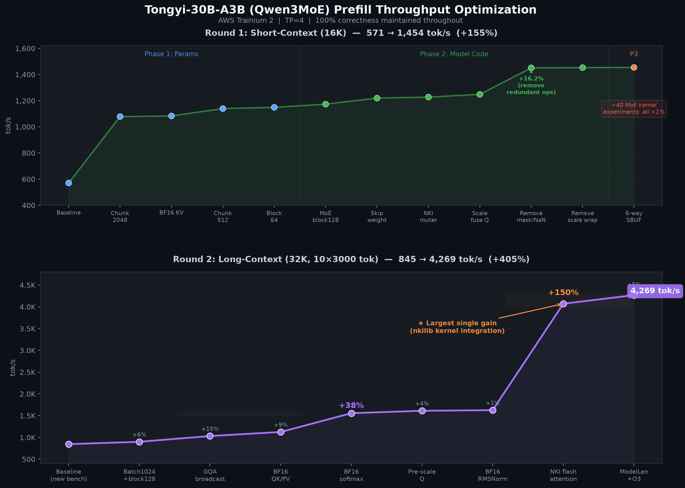

# Neuron Prefill Optimization

Autonomous optimization loop for Tongyi-30B-A3B (Qwen3MoE) prefill throughput on AWS Trainium 2.

Inspired by [karpathy/autoresearch](https://github.com/karpathy/autoresearch) — an AI agent iterates on model serving configuration, vLLM model code, and NKI kernels to maximize prefill tok/s.

## Results

### Qwen3MoE (Tongyi-30B-A3B)

Three rounds of auto-research. End-to-end speedup measured on consistent benchmarks across all time-points:

| Benchmark | Unoptimized | After Round 1 | After Round 2 | After Round 3 | Total Speedup |
|-----------|-------------|---------------|---------------|---------------|---------------|
| Medium (TP=4, 32K ctx, 10×3000 tok) | 712 tok/s | 845 tok/s | 4,269 tok/s | 12,503 tok/s | **17.6×** |
| Full (TP=8, 128K ctx, 42×3000 tok) | 258 tok/s | 365 tok/s | 1,533 tok/s | 6,200 tok/s | **24.0×** |

100% top-1 logit correctness maintained throughout.

**Per-round gains:**

| Round | Focus | Medium Gain | Full Gain |
|-------|-------|-------------|-----------|
| 1 | Param tuning (segment size, KV dtype, block size) | 712 → 845 (+19%) | 258 → 365 (+41%) |
| 2 | Model code (GQA broadcast, BF16 attention) + NKI flash_attention | 845 → 4,269 (+405%) | 365 → 1,533 (+320%) |
| 3 | Context Parallel + Local-Q (skip hidden all_gather, 4× less compute) | 4,269 → 12,503 (+193%) | 1,533 → 6,200 (+304%) |

### GPT-OSS (20B, MoE)

Two rounds of auto-research on a different MoE model. Short benchmark (≤15K context, 3000 tok/turn):

| Benchmark | Unoptimized (TP=1) | After Round 1 (TP=2) | After Round 2 (TP=3) | Total Speedup |
|-----------|---------------------|----------------------|----------------------|---------------|
| Short (≤15K ctx, 5×3000 tok) | 284 tok/s | 626 tok/s | 1,135 tok/s | **4.0×** |

100% top-1 logit correctness maintained throughout.




## Structure

```
opt/
├── program.md          # AI agent instructions (the "research org code")
├── benchmark/          # READ-ONLY judge program and configs
├── run/                # AI-editable: serving scripts and parameters
├── kernel/             # AI-editable: NKI kernel patches
├── vLLM-neuron/        # AI-editable: vLLM-neuron patches
├── docker/             # Container configuration
└── local-models/       # Compiled artifacts (gitignored)
```

## Phases

| Phase | Budget | Target | Compile? |
|-------|--------|--------|----------|
| 1: Params | 2h | run/config.env, run/serve_fast.bash | Rarely |
| 2: Model | 4h | vLLM-neuron | Yes |
| 3: Kernel | 6h | kernel | Yes |

## Quick Start

Modify the `program.md` instructions to your liking. Then open your AI-assistant like Codex, Claude Code or Opencode and let it read `program.md` and start optimizing.

## Prgress and failure that have been made are written in `optimization_report_en.md` and `optimization_report_cn,md`

## Insights and Experiences

- In long time running experiences, AI-assistant might struggle in one corner case. For example, in the first 12 hours optimization, it focused on MoE optimization and hardly care about other part. In the second 12 hours optimizaiton, I manauly let AI-assistant focus on long context optimization and it optimized the attention part.

- Auto-research is capable with modifying parameters, call for exisiting code modules and write small patch of code. It is hard for auto-research to write a whole flash-attention part of 4000 lines in a single 12 hours auto-research. In my first 12 hours run, it tried 6 hours to modify NKI, failed for about 50 experiments and got 0.6% progress.

- It is important for auto-research to create a clean and toy directory and specific what it can modify and what it cannot, other than a heavy deveploment directory.
