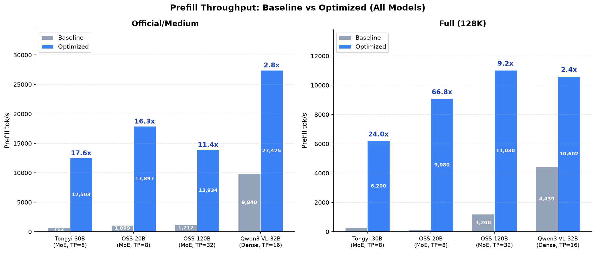
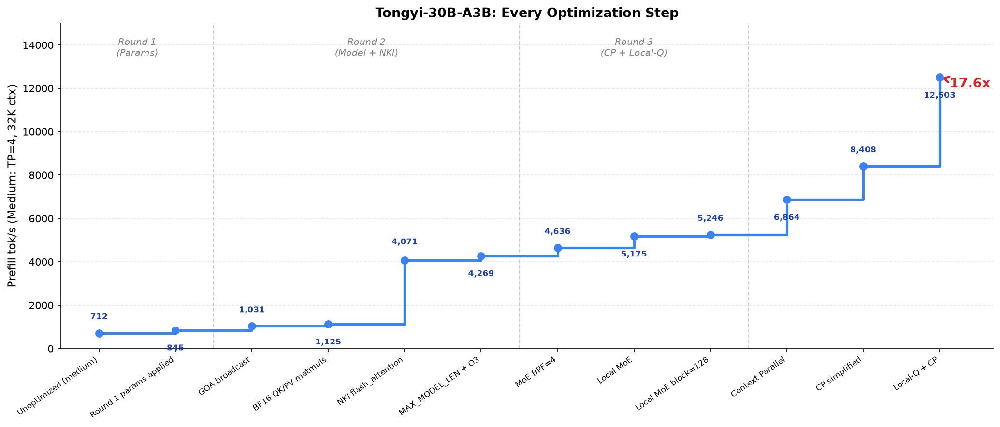

# Neuron Prefill Optimization

> **Want to use the optimized image directly?** See [release/README.md](release/README.md) for quick start instructions.

Autonomous optimization loop for LLM prefill throughput on AWS Trainium 2.

Inspired by [karpathy/autoresearch](https://github.com/karpathy/autoresearch) — an AI agent iterates on model serving configuration, vLLM model code, and NKI kernels to maximize prefill tok/s.

## Results



| Model | Type | Official Config | 128K Context | MFU (base→opt) | Correctness |
|-------|------|----------------|--------------|-----------------|-------------|
| Tongyi-30B-A3B | MoE | **17.6x** | **24.0x** | 0.28% → 4.93% | 100% |
| GPT-OSS-20B | MoE | **16.3x** | **66.7x** | 0.36% → 5.89% | 100% |
| GPT-OSS-120B | MoE | **11.4x** | **~9.2x** | 0.60% → 6.88% | 100% |
| Qwen3-VL-32B | Dense | **2.8x** | **2.4x** | 10.36% → 28.87% | 100% |

MoE models benefit most from Local-Q + Context Parallel + Local-MoE (eliminating all_gather).
Dense models gain 2-3x from Local-Q + CP + Local-MLP alone.
MFU uses standard definition: `2 × active_params × tok/s / (380 TFLOPS/core × TP cores)`. MoE models have structurally low MFU (3-5B active out of 20-120B total).

> Detailed per-round results, analysis, and constraints → [optimization_report_en.md](optimization_report_en.md) | [中文版](optimization_report_cn.md)

### Tongyi-30B-A3B Optimization Timeline



| Round | Focus | Medium (32K) | Full (128K) | MFU |
|-------|-------|--------------|-------------|-----|
| 1 | Param tuning (segment size, KV dtype, block size) | 712 → 845 (+19%) | 258 → 365 (+41%) | 0.33% |
| 2 | Model code (GQA broadcast, BF16 attn) + NKI flash_attention | 845 → 4,269 (+405%) | 365 → 1,533 (+320%) | 1.68% |
| 3 | Context Parallel + Local-Q (skip hidden all_gather) | 4,269 → 12,503 (+193%) | 1,533 → 6,200 (+304%) | 4.93% |

## Core Optimizations

All three replace large all_gather of activations with local compute on fewer tokens + a small collective at the end:

- **Local-Q**: Standard TP all_gathers full hidden states then each rank computes QKV on a shard. Local-Q flips this — each rank computes full QKV on its local tokens (seq/TP), then all_gathers only the small K/V. Saves the hidden all_gather and reduces QKV compute by TP×.
- **Context Parallel (CP)**: Prior KV cache is split across ranks. Each rank attends to 1/TP of prior context, merged via online softmax reduction (exact). Cuts prior-attention compute by TP×.
- **Local-MoE/MLP**: Each rank keeps full MoE/MLP weights, processes only local tokens, all_reduces output. Eliminates the MoE/MLP input all_gather entirely.

## Structure

```
opt/
├── program.md              # AI agent instructions
├── benchmark/              # Judge program, configs, results
│   └── all_results/        # Detailed reports and CSVs
├── run/                    # Serving scripts and parameters
├── vllm-neuron/            # Optimized vLLM-neuron fork
├── nkilib-fork/            # Optimized NKI kernels
└── docker/                 # Container configuration
```

## Quick Start

Modify `program.md` to your liking. Then open your AI-assistant (Codex, Claude Code, Opencode) and let it read `program.md` and start optimizing.

```bash
bash docker/run.bash -d
docker exec neuron-prefill bash -c "cd /dev3/zigeng/bc/opt && bash run/serve_medium.bash"
```

## Insights

- AI agents excel at parameter tuning, calling existing modules, and writing small patches. Writing 4000-line flash attention from scratch in a single session is beyond current capability.
- Long-context optimization (attention/CP) required manual steering — the agent initially fixated on MoE for 12 hours before being redirected.
- A clean, constrained directory structure (explicit editable vs read-only) is critical for productive auto-research.

